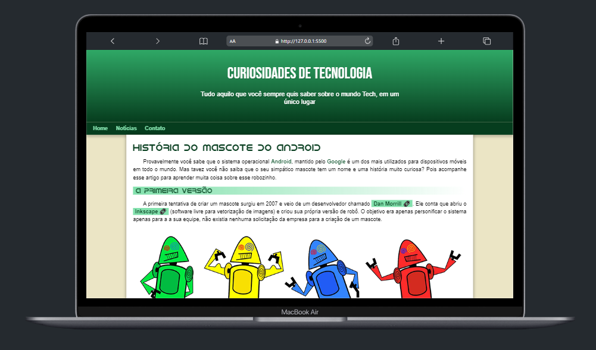

# Projeto Android
[](https://github.com/GuilhermeHenrii/projeto-android/blob/main/LICENSE)

# Sobre o projeto

Projeto Android simula um blog de notícias de tecnologias. Nesse projeto pude trabalhar muito com semântica HTMl.

## Layout mobile


## Layout web


# Tecnologias utilizadas
- HTML / CSS / JS

# Como executar o projeto
Pré-requisitos: VsCode

```bash
# clonar repositório
git clone https://github.com/GuilhermeHenrii/projeto-android.git

# entrar na pasta do projeto front end web
cd projeto-android

# Para executar o projeto execute o live server no .html raiz
```

# Autor

Guilherme Henrique da Silva Lopes

https://www.linkedin.com/in/guilherme-henrique-7aab6b229/
